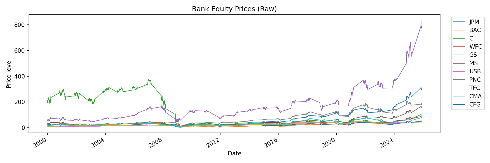
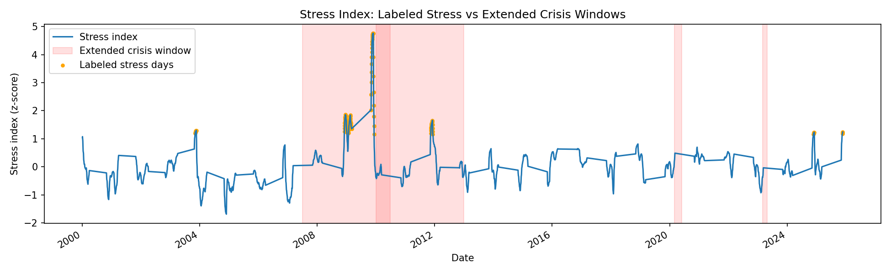
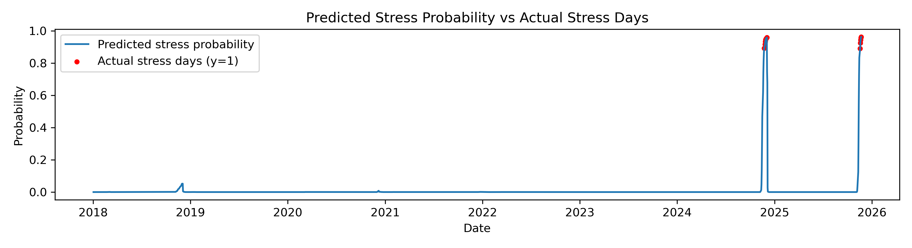

\newpage

# Abstract

Periods of financial stress in the banking sector can have a significant repercussions for the broader economy, underscoring the importance of timely detection of effective policy and risk management. This project presents a transparent, market-based framework designed to identify and predict stress within the U.S. banking sector using publicly available equity data. A bank equity stress index is constructed by integrating rolling volatility and cross-bank correlation measures derived from daily stock returns of major U.S. banks into standardized composite indicator. Stress events are defined using a high-quantile threshold on this index, supplemented by robustness checks employing alternative labelling schemes. 

To assess the predictive capacity of the stress index, a logistic regression model is trained to detect stress days utilizing lagged values of the index as explanatory variables. A strict time-based train-test split is implemented to replicate a real-time forecasting environment and to prevent look-ahead bias. The results demonstrate the proposed index aligns closely with historically recognized crisis periods, and that the baseline classifier achieves strong out-of-sample performance, particularly in the identification of extreme stress episodes. Overall, the findings indicate that equity market information alone provides valuable early-warning signals for severe stress within the banking sector.  

**Keywords:** data science, python, machine learning, bank equity, stress detection

\newpage

# Introduction

This project focuses on the early detection of stress in the U.S. banking sector using market-based indicators derived from bank equity prices. Periods of elevated financial stress within the banking system can have severe consequences for the broader economy, making timely detection of such episodes a relevant and important challenge. Market-based information, such as stock price movements and volatility, offers timely signals that may reflect rising tensions before distress becomes visible in balance-sheet or accounting data. 
To be more specific this projects addresses the problem on how to construct a transparent, data-driven indicator of bank stress using publicly available market informations of the chosen set of US banks and whether the build indicator is capable of reliably flag well-known stress periods in the U.S. history. While there do exist already sophisticated early-warning systems, they mostly rely on large macro-financial datasets or complex modelling assumptions. Creating for this project such a complex system would be taking it too far, which is why it instead focus on a simplified but yet systematic approach.

The objective of this project is to (1) build a bank equity stress index derived from stock-price data of major U.S. banks fetched from yfinance, (2) generate binary stress labels based on high-quantile thresholds of market volatility and co-movement, and in a further step (3) whether a simple logistic regression model using this stress index is able to detect meaningful out-of-sample stress days. The goal of it is not to perfectly forecast financial crises since it is a simplified approach, but rather to assess whether market-based information alone contains a useful early warning signal of potential future episodes of high stress.

The remainder of this report is structured as follows. Section 3 reviews relevant literature on financial stress indices. Section 4 describes the data and methodological approach. Section 5 presents the empirical results, followed by a discussion in Section 6 and concluding remarks in Section 7. 

# Literature Review

As mentioned before several studies in the past years have tried themselves to forecast financial stress within the economy by using different approaches of methodologies of constructing stress indices. We firstly have the St. Louis Fed Financial Stress Index (STLFSI), which combines multiple financial-market indicators to summarize the overall financial conditions. These indicators are standardized and aggregated to extract a dominant shared stress factor that captures systemic financial stress. Their dataset is based on public financial-market series from FRED, which includes treasury yields, corporate spreads, mortgage spreads, and the VIX. Compared to the approach used in this paper, the STLFSI captures a broad spectrum of U.S. financial stress instead of specifically bank-equity stress. It makes use of several heterogeneous macro variables rather than focusing mainly on bank-level market signals such as volatility and co-movement (Federal Reserve Bank of St. Louis, 2014; Wikipedia, 2024; Ritholtz, 2014).

Even though the STLFSI methodology has the most similarity to the methodology used in this paper, there are other interesting studies that can be used as a comparison. On the one side, the Cleveland Financial Stress Index (CFSI) has been designed to measure systemic stress in the U.S. financial system by using a combination of indicators from multiple financial markets. It uses daily data and attempts to detect when stress is building up across the financial system as a whole. The advantage of the CFSI is that it is system-wide and incorporates signals from multiple market segments (Bianco et al., 2012).

Lastly, the Composite Indicator of Systemic Stress (CISS), developed by Holló, Kremer, and Lo Duca (2012), measures system-wide financial stress by aggregating information from several key financial market segments, including financial intermediaries, equity markets, money markets, bond markets, and foreign exchange markets. The CISS explicitly accounts for systemic interactions across financial markets and is primarily designed to measure systemic risk in the European financial system.

The insights from these indices guide the design of the stress index in this project, which applies the principles of volatility, co-movement, and standardized aggregation to a targeted set of U.S. bank equity series. In contrast to existing indices that are broad and multi-market, this project focuses exclusively on daily bank equity data, leaving room for a more focused measure built entirely from market-based signals at the sector level.

# Methodology

The literature of financial stress indices displays that most established measures such as the St. Louis Fed Financial Stress Index, the Cleveland Financial Stress Index and Composite Indicator of Systemic Stress combine multiple standardized components to capture market uncertainty and systemic risk. As mentioned before these stress indices rely were designed for broad macro-financial monitoring and not truly for analysing equity-based stress in a specific sector like the U.S. banks. But it those build on the common principles identified in prior work such as the standardization, aggregation of risk signals and responsiveness during crisis-periods. 

The following methodology explains how the entire data has been collected, how volatility and correlation components were computed, how the stress composite was constructed, how exactly the stress is labelled and how the machine-learning model was built on top of this index. 

## Data Description 

Regarding the raw dataset, it consists of daily adjusted closing prices for eleven publicly traded U.S. banks:

| Ticker | Full Name | Bank Type |
|------|-----------|-----------|
| JPM | JPMorgan Chase & Co. | Global systemically important bank (GSIB) |
| BAC | Bank of America Corporation | Global systemically important bank (GSIB) |
| C | Citigroup Inc. | Global systemically important bank (GSIB) |
| WFC | Wells Fargo & Company | Large U.S. bank |
| GS | Goldman Sachs Group, Inc. | Global investment bank (GSIB) |
| MS | Morgan Stanley | Global investment bank (GSIB) |
| USB | U.S. Bancorp | Large regional bank |
| PNC | PNC Financial Services Group | Large regional bank |
| TFC | Truist Financial Corporation | Large regional bank |
| CMA | Comerica Incorporated | Regional bank |
| CFG | Citizens Financial Group, Inc. | Regional bank |

These institutions represent a mix of globally systemically important banks, large regional banks and mid-size lenders. 
Since yfinance could not be accessed directly in the Nuvolos environment, the data had to be downloaded manually via Google Collab using the yfinance API. The resulting file, sample_prices.csv, was then imported into the project's data/raw/ directory. Although the original approach by importing the dataset within the Nuvolos VS Code environment did not work, the intended workflow is still reflected in the project structure. In this workflow, the data_utils.py module would have first read the list of selected banks from config/tickers.csv and automated the download and preprocessing of the raw data. In a second step, the notebook 01_download_data_and_eda.ipynb would have reloaded the generated sample_prices.csv file and performed a light cleaning/sanitizing process. Even though this automated pipeline could not be executed, all files are intentionally kept in the repository to document the intended architecture. The notebook 01_download_data_and_eda.ipynb still proved useful by providing an overview of the dataset structure and its contents. 
The dataset consists of 2356 daily price records per ticker over the time period going from beginning of January 2000 till today. The important features of the dataset are the 11 price series (one per bank). Each row matches to a calendar trading day, and each column corresponds to the adjusted closing price of one bank. While running the quality check over the integrity of our dataset there were no missing values found for 10 of the 11 tickers. However, CFG shows that around 59% of the observations are missing. This is due to the reason that CGF only became publicly traded in September 2014, leaving no historical price data before its Initial Public Offering (Citizens Financial Group, 2025). Even though the trading window is shorter compared to the other tickers, CFG was still kept among the sample. Beside that no other data integrity issues were found, and all columns were successfully standardized and cleaned. 
Within the first notebook you can find a graphic illustrating the evolution of the daily financial time series for each ticker (raw price plot). It should essentially show the heterogeneity in levels and trajectories across banks. Certain institutions such as GS (Goldman Sachs) exhibit substantially higher price levels than others, while regional banks in comparison show lower and more stable price ranges. The plot also illustrates the price dynamics differ across banks, including periods of declines, recoveries and long-term growth, without implying any specific macroeconomic events. 


*Figure 1: Daily adjusted closing prices for the 11 selected U.S. banks.*

## Approach

The project follows a two-stage approach. As for the first algorithm a bank-equity stress index was constructed from the bank equity log returns. The daily log returns are computed from daily adjusted closing prices, which stabilizes variance and ensures that returns can be additive over time. The index is based on two-system level components computed from the returns: (1) average rolling volatility across banks capturing individual bank uncertainty and (2) average rolling pairwise correlation across banks to capture the system-wide cross-bank co-movement. The components are then in a second step standardized using z-score transformation to be comparable : 

$$
z_t = \frac{x_t - \mu}{\sigma}
$$

where $\mu$ and $\sigma$ denote the mean and standard deviation of the corresponding time series.
Afterwards the components are combined into a single composite index with equal weights:

$$
\text{stress\_index}_t
= w_{\text{vol}} \cdot z_{\text{vol},t}
+ w_{\text{corr}} \cdot z_{\text{corr},t}
$$

So the cross-sectional averages of volatility and correlation are combined into a system-level stress index. For improving reasons such as producing a less noisy series while keeping the main movements intact, a smoothing tool was applied on to the stress index. This index provides a transparent, interpretable measure of stress based purely on equity-market information. 
To evaluate whether the constructed stress index contains useful signals for this project, the index is converted into binary stress labels using a quantile-based rule, where the stress days are defined as observations in the upper tail of the index distribution. A day is labelled as stress (1) if the stress index is above the 95th percentile of its historical distribution. Otherwise it is labelled as non-stress (0): 

$$
y_t =
\begin{cases}
1, & \text{if } \text{stress\_index}_t \ge \tau \\
0, & \text{otherwise}
\end{cases}
$$

Any missing values in the stress index are mapped to the non-stress class to avoid introducing undefined labels.
Next to the main specification alternative thresholds and combined labelling schemes are used as a robustness check. The robustness check consists of a more lenient threshold using the 90th percentile and a combined method that integrates threshold-based labels (q=0.95),event windows around selected dates and crisis-window overrides. The event window labelling is essentially a function which creates a label series that marks a contiguous window around a specific event date. Therefore all dates within the interval:

$$
t \in \big[\, t_{\text{event}} - p_{\text{pre}},\; t_{\text{event}} + p_{\text{post}} \,\big],
$$

are assigned the stress label 1. In case the exact event is not present in the index (e.g. non-trading day), the nearest available date is used. The crisis override labelling is a helper function who forces date sets within known crisis windows to be labelled as 1. Each crisis window is given as a (start_date, end_date) pair. Every date within that range (inclusive) is assigned automatically the label 1 regardless of the threshold/event rules. This provides a manual mechanism to ensure that known stress windows are fully captured.
 
For the second algorithm a logistic regression classifier is used as a baseline supervised learning model to predict binary stress events derived from the stress index. Before building the classification model the processed stress index and derived labels are aligned on common dates, missing values from the rolling operations are removed, and lagged versions of the stress index are assembled into a feature matrix. On top of that a strict-time based train-test split is applied, which splits the data using fixed calendar date, to prevent any look-ahead bias and should mimic a real-time forecasting setup. 
After all the above mentioned steps are executed the logistic regression model estimates the probability of a stress days as follow: 

$$
P(y_t = 1 \mid \mathbf{X}_t)
= \frac{1}{1 + \exp\!\left(-(\beta_0 + \boldsymbol{\beta}^\top \mathbf{X}_t)\right)}
$$

where:

- $\mathbf{X}_t$ is the feature vector at time $t$,
- $\boldsymbol{\beta}$ are the learned model coefficients,
- class weights are applied to account for class imbalance.

Before model estimation, all features are standardized:

$$
\mathbf{X}_t^{\text{scaled}} = \frac{\mathbf{X}_t - \boldsymbol{\mu}_X}{\boldsymbol{\sigma}_X}
$$

To determine if the model predicts well or not the stress events, we need to implement evaluation methods to assess the accuracy of the model. The model performance is evaluated using metrics appropriate for imbalanced binary classification, including ROC AUC, average precision, accuracy, precision, and recall for the stress class. The evaluation is exclusively conducted on the held-out test set, and the robustness check as mentioned before is assessed by comparing the results across alternative labelling thresholds. 

## Implementation

The entire project was implemented in Python. The core numerical and data-handling functionality is delivered by the NumPy and pandas libraries. The NumPy library is mainly applied within the project for low-level operations, including array-based computations, statistical moments such as standard deviations and means, and also for efficient vectorized transformations required for the z-score normalization and rolling-window calculations. The pandas library supplies as the primary data container and time-series engine. It is used vastly within our python modules such as for the handling the financial time-series indexed by dates, the computation of the rolling volatility and rolling correlations, aligning the stress indices, labels, and features across date ranges, and it takes care of the missing values within our dataset and ensures the consistency in the indexing throughout the pipeline. 
Besides our core libraries we take usage of the matplotlib and scikit-learn displaying helpers such as RocCurveDisplay and PrecisionRecallDisplay for the creation of plots (visualization). scikit-learn is also applied for the modelling stage. The objective was not to build a complex deep learning system but rather to establish a transparent and fully reproducible baseline classifier which evaluates whether the constructed stress index contains predictive information regarding bank stress days. It especially uses the following components: 

- **LogisticRegression** : 
A logistic regression classifier is employed as the baseline model for the detection for stress. It estimates the probability that a given day is considered a stress event based in features of the constructed stress index. The class weights are set to "balanced" to explicitly address the strong class imbalance between stress and non-stress (calm) days. 

- **StandardScaler**: 
The feature standardization is applied to the model estimation. Each single feature is transformed to have a mean equal to zero and a unit variance, guaranteeing that coefficients in the logistic regression are not dominated by scale difference across inputs. 
The scale and classifier are combined into a single Pipeline, ensuring that preprocessing is applied consistently during both training and out-of-sample evaluation, and preventing data leakage. 

- **Evaluation utilities from sklearn.metrics**: 
The model performance is evaluated using several metrics: (1) ROC AUC, which measures the overall ranking quality; (2) Average Precision (PR AUC), especially useful in cases of class imbalance; (3) accuracy, to provide a general measure; (4) precision and recall specifically for the stress class (class = 1); and (5) classification reports that summarize performance for each class. 

Lastly, the model persistence and experiment reproducibility are supported via joblib, which is used to serialize trained model to disk, enabling consistent reuse during the evaluation and reporting. 

Overall, the implementation prioritizes modularity, transparency, and reproducibility. Each step of the pipeline - feature construction, stress index calculation, label generation, model training, and evaluation - is organized into distinct modules and functions. This structure enables the entire workflow to be run end-to-end through a single entry-point script, while keeping the process easy to understand and extend. The pipeline is based on four layers. The modules of feature and index construction build the first two layers, which essentially construct the per-bank and system-level market features from price-based returns and turn those features into a composite stress index by z-scoring the components, weighting them, and lastly smoothing it with EMWA. Third layer consists of the label construction module, that converts the continuous stress index into binary stress labels using for one a quantile threshold, event windows, crisis window overrides, and a combined approach for robustness. The fourth layer is based on the model training and evaluation. It first constructs the supervised dataset, applies a time-based train/test split, trains a baseline logistic regression, and computes evaluation metrics. Afterwards the evaluation utilities are wrapped into one module covering confusion counts, ROC/PR curves, and probability-score extraction. 
The module main.py acts as a glue script that runs the full end-to-end workflow. It loads the processed CSVs, buils the ML dataset, splits, trains, evaluates and saves the plots and metrics. 
For each python module except main.py there is a corresponding notebook exploring the intermediate results of the project and a test python module. 

The key code components of our pipeline cover several functions and classes, playing a central role in the implementation. Summed up, the methodology was implemented in Python using NumPy and pandas for numerical computations and time-series data handling, and scikit-learn for model estimation and evaluation. The implementation integrates feature construction, stress index computation, label generation, and supervised classification within a modular pipeline to ensure reproducibility and consistent application of preprocessing steps across experiments.

# Results

## Experimental Setup

For the computational setup we differentiate between hardware and software. As for the software the integrity of the libaries used within the setup were mentioned in the chapter before. All experiments were conducted in a standard CPU-based computing environment. 

The modeling setup intentionally uses a minimal and transparent set of hyperparameters: rollling window size: 20 trading days (volatility and correlation), stress threshold quantile set at 0.95 for the main specification and 0.9 for the robustness check, five lagged values of the stress index as model inputs (features), allowing the model to capture short-term persistence in financial stress while relying only on past information, logistic regression regularization: default setting (C = 1.0), balanced class weigts to handle the small number of stress days, and a fixed random state to ensure reproducible results

To respect the temporal structure of the data, a time-based train/test split is applied. All observations prior to January 1 of 2018 are used for the model training, while the rest of the observations from January 1, 2018 onward are reserved for the out-of-sample evaluation. The model is trained once per labelling specification without cross-validation or extensive hyperparameters tuning listed above. This specific design choice allows to prioritize interpretability and realistic out-of-sample validation. 

## Performance Evaluation

Table 1 summarizes the model performance for the out-of-sample performance of the baseline logistic regression model under three different labelling specifications: the main-threshold-based labelling with q = 0.95, a robustness specification with q = 0.9, and a combined labelling scheme that incorporates the main threshold, event windows and crisis overrides. The model is trained on an out-of-sample test set using a time-based split. The training data covers the observation prior the date 01.01.2018, and the test data consists of all subsequent observations. In addition to the tabulate results below, model performance was also inspected using the detailed evaluation output printed by the main pipeline script (main.py), including confusion matrices and per-class classification reports. These outputs are consistent with the summarized metrics reported in Table 1. 

| Label specification | ROC AUC | Avg. Precision | Recall (stress days) |
|---------------------|---------|----------------|----------------------|
| q = 0.95 (main)     | 1.000   | 1.000          | 1.000                |
| q = 0.90 (robust)   | 0.999   | 0.995          | 0.961                |
| Combined labels     | 0.641   | 0.412          | 0.600                |

*Table 1: Out-of-sample performance across label specifications.*

The evaluation focuses on the model's ability to correctly predict bank stress days (class 1) in a highly imbalanced setting. 

The main specification (q = 0,95) achieves the strongest overall performance, with the logistic regression model attaining perfect ranking on the test set, reflected by the ROC AUC and precision recall of 1.00. It successfully identifies all stress days during the test period, reaching a perfect recall for stress events. While precision is somewhat lower (0.550) due to a small number of small of false positive with exactly 9 days, this trade-off is expected and acceptable given the rarity of stress events and early-warning context, where missing stress periods is more costly than issuing false alarms. The confusion matrix confirms these results, showing zero false negatives and only a limited number of false positives. This indicates that the stress index provides a strong and clean signal for detecting extreme stress periods when stress is defined conservatively using the 95th percentile threshold.

Lowering the stress threshold to the 90th percentile (q = 0.9) increases the proportion of days labelled as stress, making the classification task more challenging. Despite this, the model maintains very strong performance, with the ROC AUC remaining close to one and recall for stress days staying above 96%. Compared to the main specification, precision decreases slightly, which is expected since the number of false positives increases from the more lenient stress definition. However, the robustness specification also demonstrates a substantial improvement in precision relative to the main specification, reflecting that labelling more days as days reduces class imbalance and leads to more conservative predictions. Altogether, these results indicate that the model's performance is robust to reasonable changes in the labelling threshold. 

Using the combined labelling approach leads to a considerable deterioration of the performance. The ROC AUC drops to 0.641, and average precision falls below 0.42, indicating that the model struggles to effectively distinguish between stress and non-stress days. This  decline is consistent with the construction of the combined labels, which increases the number of stress days by assigning stress labels within the fixed event windows and the pre-defined crisis periods. Consequently, the labels become less closely linked to the extreme fluctuations in the stress index, weakening the relationship between features and targets and introducing a significant noise that makes the classification task less well-defined. 

Overall, the results indicate that the threshold-based labelling approach with a high quantile (q = 0.95) provides the most reliable signal for bank stress detection. 

## Visualizations

Figure 2 depicts the constructed stress index over time, highlighting labelled stress days and comparing them with the crisis windows. These windows encompass major financial stress episodes such as the Global Financial Crisis from 2007 till 2009, the Eurozone sovereign debt crisis (2010-2012), the COVID-19 market crash (initial shock going from March till April 2020), and the U.S. regional banking stress episode in March 2023. The figure reveals that labelled stress days are strongly concentrated around these well-known crisis  periods, especially during the Global Financial Crisis (Wikipedia contributors, 2025; Liberto, 2025; Osborne, 2025; Wikipedia contributors, 2025). Though defining precise crisis dates is inherently ambiguous, as different sources report sometimes slightly different timelines for the onset and resolution of major financial crisis. To account for this uncertainty, the analysis uses 'extended' crisis windows that encompass the commonly accepted stress periods. Overall, more than 80% of labelled stress days occur within the predefined crisis windows (95 days out of 118). This visual correlation supports the economic significance of the stress index and validates the threshold-based labelling approach. 


*Figure 2: Stress index over time with labelled stress days highlighted and compared against extended crisis windows.*

Though next to the stress episodes aligned with the predefined crisis windows, there are occasional short-lived spikes outside those windows. These isolated spikes likely represent temporary market disruptions or localized uncertainties that did not develop into a full systemic crisis. Most of the labelled days cluster within the major crisis, which is the key validation. In short, the visual alignment confirms that the index captures economically meaningful stress dynamics while remaining responsive to short-term shocks. 

Figure 3 shows predicted stress probabilities from the logistic regression model alongside the actual stress labels during the out-of-sample test period. In calm periods, predicted probabilities stay close to zero, while sharp spikes appear during severe stress episodes. The model responds promptly to emerging stress conditions, assigning high probabilities precisely on labelled stress days. This pattern demonstrates strong temporal discrimination and a low false-alarm rate. At the same time, the model appears conservative, reacting primarily to extreme stress conditions rather than moderate turbulence. 


*Figure 3: Predicted stress probabilities from the logistic regression model compared to actual stress days in the test period.*

Together, these visualizations complement the numerical results by showing the economic interpretability and temporal consistency of the model outputs. 

# Discussion

The results demonstrate that the constructed equity-based stress index aligns closely with historically recognized financial crisis periods, especially during the severe market distress like the Global Financial Crisis. This visual and statistical correspondence confirms that the index captures meaningful economic stress dynamics rather than random market noise. 
Using the primary threshold-based labelling (q = 0.95), the baseline logistic regression achieves a very strong out-of-sample performance, with a high ROC AUC and perfect recall for stress days. Predicted stress probabilities remain close to zero during tranquil periods and spike sharply during the stress episodes, indicating clear temporal distinction. This suggests that even a simple and interpretable model can effectively identify extreme stress periods when combined with a well-designed stress index.
A key challenge though during the analysis was the definition of stress labels, as crisis timelines differ across data sources. This is addressed by using extended crisis windows and robustness checks with alternative thresholds. As expected, lowering the threshold increases sensitivity but introduces more false positives, illustrating the trade-off between recall and precision. 
The main limitation of the approach are its reliance on equity-market data only and the use of a simple linear model, which solely relies on the stress index and its lagged values without incorporating bank-level balance sheet data or macroeconomic controls. While this improves transparency and interpretability, it limits the detection of moderate stress episodes and excludes information from other financial markets. Nevertheless, the strong performance of the baseline model highlights the value of careful feature construction and label design. 

# Conclusion

## Summary

This project developed a practical, transparent, and reproducible framework for monitoring stress in the U.S. banking sector using an equity-based stress index derived from bank stock volatility and correlations. The stress index aligns closely with major historical crisis periods, capturing meaningful economic stress signals. Combined with a simple logistic regression classifier and a threshold-based labelling strategy, the approach achieves strong out-of-sample performance, particularly in identifying extreme stress events with a high recall. The results demonstrate that even a lightweight, interpretable model can provide timely and informative signals of bank stress with a low false-alarm rate, making it suitable for applied financial monitoring and functions as an early-warning tool for severe banking stress. 

## Future Work

Further enhancements could incorporate additional financial indicators such as credit spreadings, funding market measures, or macroeconomic variables to capture stress beyond equity markets. Refinements to the labelling strategy such as adaptive thresholds or rolling calibration could improve the detection of moderate or emerging stress episodes. Methodologically, exploring more flexible models and conducting further validation with cross-validation or rolling-window approaches would offer deeper insights into model stability. From an operational standpoint, an option could be to automate the pipeline for near real-time monitoring and scaling the framework to cover a broader set of financial institutions, including international banks, would increase its practical relevance for regulators, risk managers, and market analysts. 

\newpage

# References

1. Federal Reserve Bank of St. Louis. (2014). *What Is the St. Louis Fed Financial Stress Index?* On the Economy Blog. 
<https://www.stlouisfed.org/on-the-economy/2014/june/what-is-the-st-louis-fed-financial-stress-index>

2. Wikipedia contributors. (2024). *St. Louis Fed Financial Stress Index*. Wikipedia. <https://en.wikipedia.org/wiki/St._Louis_Fed_Financial_Stress_Index>

3. Ritholtz, B. (2014). *What Is the St. Louis Fed Financial Stress Index?* The Big Picture Blog. 
<https://ritholtz.com/2014/06/what-is-the-st-louis-fed-financial-stress-index/>

4. Bianco, T., Gramlich, D., Oet, M. V., & Ong, S. J. (2012). *Financial stress index: A lens for supervising the financial system.* Federal Reserve Bank of Cleveland Working Paper No. 12-37. 
<https://ideas.repec.org/p/fip/fedcwp/1237.html>

5. Holló, D., Kremer, M., & Lo Duca, M. (2012). *CISS – A composite indicator of systemic stress in the financial system.* European Central Bank Working Paper No. 1426. 
<https://www.ecb.europa.eu/pub/pdf/scpwps/ecbwp1426.pdf>

6. Citizens Financial Group. (2025, August 14). *Citizens Financial Group*. Wikipedia.  <https://en.wikipedia.org/wiki/Citizens_Financial_Group>

7. Wikipedia contributors. (2025). 2008 financial crisis. Wikipedia. 
<https://en.wikipedia.org/wiki/2008_financial_crisis>

8. Liberto, D. (2025, September 29). Eurozone debt crisis: Causes, consequences, and solutions (2008–2012). Investopedia. 
<https://www.investopedia.com/terms/e/european-sovereign-debt-crisis.asp$>

9. Osborne, M. (2025, April 7). Black Monday to the COVID crash: Worst days in the history of the U.S. stock market. ABC News. 
<https://abcnews.go.com/Business/black-monday-covid-crash-worst-days-history-us/story?id=120559417>

10. Wikipedia contributors. (2025). 2023 United States banking crisis. Wikipedia. 
<https://en.wikipedia.org/wiki/2023_United_States_banking_crisis>

\newpage

# Appendices

## Appendix A: Additional Results

Next to the figures depicted in the paper other important results will be visible when executing the module main.py. It will generate several figures such as the ROC AUC curve and the precision curve for each of the three labelling approaches. Withtin the notebooks you can also find further intermediate results. 

## Appendix B: AI Usage Disclosure 

For the project I have used the AI tools ChatGPT and GitHub Copilot:

- I used Copilot and ChatGPT for helping me with the coding of the project and to receive a better understanding on how VS Code Nuvolos is linked with GitHub. Since I have never used GitHub before, I needed certain guidance on how GitHub works and the specific commands to commit everything on to my GitHub repository. 

- ChatGPT was used to help with debugging. I also used ChatGPT when converting my markdown file of the paper to a pdf file version. While converting I encountered some issues, which is why the markdown file of the paper is called 'project_report_clean.md' instead of 'project_report.md'. 

- ChatGPT and Copilot helped me with having a better idea on how to build a good interactive GitHub repository. 

- ChatGPT also helped me with defining my crisis windows since as mentionned before sources defined the timelines of those crisis differently. 

- ChatGPT gave me an overview on how to build the paper and making sure that I have a correct interpretation of all my results. It also helped me with writing the mathematical formulas correctly and writing the tables.  

## Appendix C: Code Repository

GitHub Repository:  
[Bank Stress Detection Project](https://github.com/cilenia-gif/bank_stress_detection_project_datascience_class/tree/main)

### Repository Structure

```
bank_stress_detection_project/
├── README.md
├── PROJECT_README.md
├── PROPOSAL.md
├── project_report.md
├── requirements.txt
├── environment.yml
├── pyproject.toml
├── main.py
│
├── data/
│   ├── raw/
│   │   ├── sample_prices.csv
│   │   └── backup.csv
│   └── processed/
│       ├── returns.csv
│       ├── rolling_vol.csv
│       ├── rolling_corr.csv
│       ├── stress_index.csv
│       ├── stress_labels.csv
│       ├── stress_labels_q90.csv
│       └── stress_labels_combined.csv
│
├── notebooks/
│   ├── 01_data_download_and_eda.ipynb
│   ├── 02_feature_engineering.ipynb
│   ├── 03_label_construction.ipynb
│   ├── 04_model_training.ipynb
│   └── 05_model_evaluation.ipynb
│
├── src/
│   └── bank_stress/
│       ├── __init__.py
│       ├── data_utils.py
│       ├── features.py
│       ├── index.py
│       ├── labels.py
│       ├── models.py
│       └── evaluation.py
│
├── results/
│   ├── figures/
│   │   ├── stress_index.png
│   │   ├── stress_index_extended_crisis_comparison.png
│   │   ├── predicted_stress_probabilities.png
│   │   ├── baseline_q95_main_roc_curve.png
│   │   └── baseline_q95_main_pr_curve.png
│   ├── metrics/
│   │   ├── baseline_logit_main_metrics.json
│   │   └── robustness_metrics.csv
│   └── models/
│       └── baseline_logit_main.joblib
│
└── tests/
    ├── test_data_utils.py
    ├── test_features.py
    ├── test_index.py
    ├── test_labels.py
    ├── test_models.py
    └── test_evaluation.py
```

### Installation Instructions

Commands for cloning the repository : 

git clone 
<https://github.com/cilenia-gif/bank_stress_detection_project_datascience_class/tree/main>

cd bank_stress_detection_project_datascience_class

Commands for creation of the environment and results of main.py: 

1. Create the conda environment :
conda env create -f environment.yml

2. Activate the environment: 
conda activate bank-stress-project

3. Run the full pipeline for the reproduction of results from main.py:
python main.py

